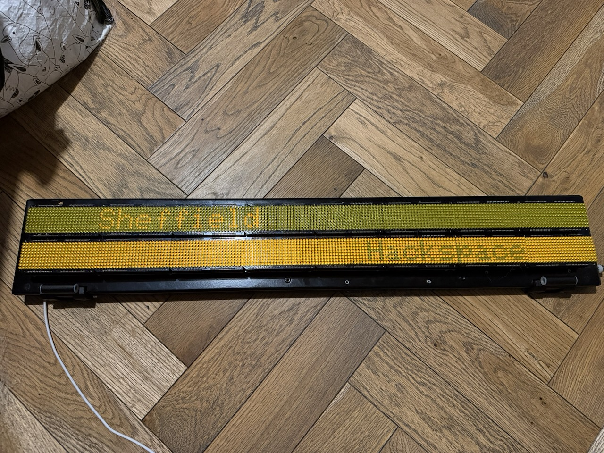
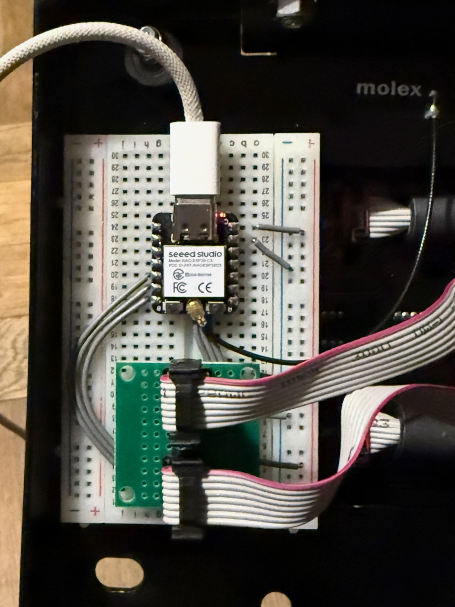

# display-infotec-bay-indicator

An Adafruit GFX compatible driver for the Infotec bay indicator AS1100-based dot matrix display.



## Hardware

* Display dimensions: 192 × 9
* Number of displays: 2
* Operating voltage: 3.3V
* Power voltage: 5V

### Schematic


See the [KiCad project](./kicad) for the full schematic.

### PCB Design


### Prototype



## Installation

Add the following to your `platformio.ini`:

```ini
lib_deps =
    adafruit/Adafruit BusIO
    adafruit/Adafruit GFX Library
    https://github.com/sheffieldhackspace/display-infotec-bay-indicator
```

## Dependencies

* [Adafruit BusIO](https://github.com/adafruit/Adafruit_BusIO)
* [Adafruit GFX Library](https://github.com/adafruit/Adafruit-GFX-Library)
* ESP32 with FreeRTOS (required for the keepalive task)

## Usage

```cpp
#include <BayIndicator.h>

BayIndicator display1 = BayIndicator(D5, D6, D4);
BayIndicator display2 = BayIndicator(D8, D7, D9);

void setup() {
    delay(1000); // Give the display a moment to power up before configuring it

    display1.begin();
    display1.fillScreen(0);
    display1.setCursor(1, 1);
    display1.print("Sheffield");
    display1.display();

    display2.begin();
    display2.fillScreen(0);
    display2.setCursor(1, 1);
    display2.print("Hackspace");
    display2.display();
}

void loop() {
    // update displays as needed
    display1.display();
    display2.display();
}
```

Since `BayIndicator` inherits from `GFXcanvas1`, the full [Adafruit GFX API](https://learn.adafruit.com/adafruit-gfx-graphics-library) is available for drawing text, shapes, and bitmaps. Call `display.display()` to flush the canvas to the hardware.

## Examples

Three examples are included in the `examples/` directory. To build and flash them, clone the repository and run:

```bash
# Show a hardware test pattern
pio run -t upload -e test

# Show a checkerboard pattern
pio run -t upload -e checkerboard

# Scroll two lines of text around the display
pio run -t upload -e movingwords
```

## Acknowledgements

Inspired by the works of [`alifeee`](https://github.com/alifeee/bus-signs) and
[`ConnectedHumber`](https://github.com/ConnectedHumber/Bus-Terminal-Signs).
The reverse engineering work of the display's segment layout and SPI protocol
was instrumental in the development of this library.
